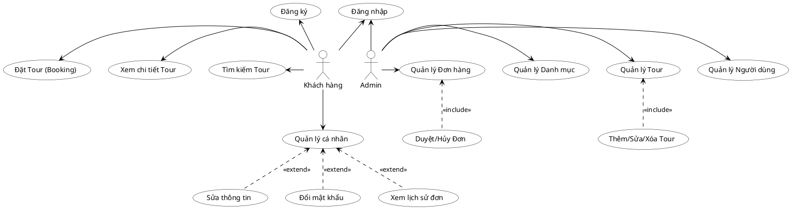

TRƯỜNG ĐẠI HỌC TÀI NGUYÊN VÀ MÔI TRƯỜNG HÀ NỘI
KHOA CÔNG NGHỆ THÔNG TIN

---

# BÁO CÁO KHOÁ LUẬN TỐT NGHIỆP

**Đề tài:**  
Xây dựng hệ thống gợi ý và đặt tour du lịch thông minh với AI Travel Advisor cùng tự động hoá DevOps cho doanh nghiệp VN-Travel

**Sinh viên thực hiện:** Đinh Tuấn Mạnh  
**Mã sinh viên:** 22111062516  
**Lớp:** DH12C2  
**Ngành:** Công Nghệ Thông Tin  
**Giảng viên hướng dẫn:** ThS. Trần Minh Thắng  

**HÀ NỘI – Năm 2026**

---

## BẢN CAM ĐOAN

Tên tôi là: Đinh Tuấn Mạnh  
Mã sinh viên: 22111062516  
Lớp: DH12C2  
Ngành: Công Nghệ thông tin  

Tôi đã thực hiện khóa luận với đề tài: **“Xây dựng hệ thống gợi ý và đặt tour du lịch thông minh với AI Travel Advisor cùng tự động hoá DevOps cho doanh nghiệp VN-Travel”**.

Tôi xin cam đoan đây là đề tài nghiên cứu của riêng tôi và được sự hướng dẫn của giảng viên ThS. Trần Minh Thắng. Các nội dung nghiên cứu, kết quả trong đề tài này là trung thực và chưa được công bố dưới bất kỳ hình thức nào. Nếu phát hiện hiện có bất kỳ hình thức gian lận nào tôi xin hoàn toàn chịu trách nhiệm trước pháp luật.

*Hà Nội, ngày 26 tháng 01 năm 2026*  

**Sinh viên thực hiện**  
(Ký và ghi rõ họ tên)  

Đinh Tuấn Mạnh

---

## LỜI CẢM ƠN

Sau thời gian thực hiện khóa luận tốt nghiệp, đến nay mọi công việc liên quan đến khóa luận đã hoàn tất. Để có sự thành công này, em xin gửi lời cảm ơn chân thành đến tất cả các thầy, cô giáo trường Đại học Tài Nguyên và Môi Trường Hà Nội.

Em xin gửi lời cảm ơn chân thành nhất tới **ThS. Trần Minh Thắng**, người đã tận tình hướng dẫn, giúp đỡ em trong suốt quá trình làm khóa luận. Thầy đã giúp đỡ em trong việc chọn đề tài, hình thành những ý tưởng, những góp ý, chỉnh sửa để đề tài được hoàn thiện một cách tốt nhất có thể.

Em cũng xin gửi lời cảm ơn đến khoa Công nghệ thông tin – Trường Đại Học Tài Nguyên và Môi Trường Hà Nội đã luôn quan tâm, tạo điều kiện giúp em hoàn thành khóa luận tốt nghiệp này.

Vì thời gian, khả năng của bản thân có hạn mặc dù đã rất cố gắng hoàn thành khóa luận xong vẫn không tránh khỏi những sai sót. Em rất mong nhận được sự đóng góp, bổ sung ý kiến của quý thầy cô để khóa luận của em được hoàn thiện hơn.

Cuối cùng, em xin kính chúc các thầy cô giảng viên trường Đại học Tài nguyên và Môi trường Hà Nội nói chung, các thầy cô khoa Công nghệ thông tin nói riêng dồi dào sức khỏe và thành công trong sự nghiệp cao quý.

Em xin chân thành cảm ơn!

---

## MỤC LỤC

1. [LỜI MỞ ĐẦU](#lời-mở-đầu)
2. [CHƯƠNG 1: TỔNG QUAN VỀ ĐỀ TÀI](#chương-1-tổng-quan-về-đề-tài)
    - 1.1 Giới thiệu đề tài
    - 1.2 Tính mới và đóng góp của đề tài
    - 1.3 Mục tiêu của đề tài
    - 1.4 Phạm vi và giới hạn
    - 1.5 Phương pháp nghiên cứu
3. [CHƯƠNG 2: CƠ SỞ LÝ THUYẾT](#chương-2-cơ-sở-lý-thuyết)
    - 2.1 Tổng quan về Django Framework
    - 2.2 Hệ quản trị cơ sở dữ liệu PostgreSQL
    - 2.3 Trí tuệ nhân tạo Generative AI và Google Gemini
    - 2.4 Kiến trúc Chatbot và RAG
    - 2.5 Các công nghệ tích hợp (Google Maps, OpenWeather, MoMo)
4. [CHƯƠNG 3: PHÂN TÍCH VÀ THIẾT KẾ HỆ THỐNG](#chương-3-phân-tích-và-thiết-kế-hệ-thống)
    - 3.1 Đặc tả yêu cầu
    - 3.2 Thiết kế cơ sở dữ liệu
    - 3.3 Thiết kế kiến trúc hệ thống
5. [CHƯƠNG 4: CÀI ĐẶT VÀ TRIỂN KHAI](#chương-4-cài-đặt-và-triển-khai)
    - 4.1 Môi trường cài đặt
    - 4.2 Demo các chức năng chính
    - 4.3 Kết quả kiểm thử
6. [TỔNG KẾT](#tổng-kết)

---

## LỜI MỞ ĐẦU

Trong kỷ nguyên số hóa 4.0, ngành du lịch đang chứng kiến sự chuyển mình mạnh mẽ, và du lịch trực tuyến (E-Tourism) đã trở thành một phần không thể thiếu trong nền kinh tế số. Theo báo cáo của Statista (2023), doanh thu thị trường du lịch trực tuyến toàn cầu dự kiến sẽ đạt mức tăng trưởng ấn tượng trong những năm tới. Điều này cho thấy sự bùng nổ của xu hướng đặt tour du lịch qua mạng trên toàn thế giới, và Việt Nam không nằm ngoài xu thế đó. Tại Việt Nam, với sự phổ biến của Internet và smartphone, hành vi của khách du lịch đang thay đổi nhanh chóng từ đặt tour truyền thống sang các nền tảng trực tuyến tiện lợi.

Trong bối cảnh đó, các doanh nghiệp lữ hành truyền thống cần đổi mới và ứng dụng công nghệ để đáp ứng nhu cầu ngày càng cao của thị trường. **"Xây dựng hệ thống gợi ý và đặt tour du lịch thông minh với AI Travel Advisor cùng tự động hoá DevOps cho doanh nghiệp VN-Travel"** là một giải pháp hiện đại giúp công ty lữ hành nâng cao trải nghiệm khách hàng, tối ưu hóa quy trình vận hành và tăng trưởng doanh thu.

Hệ thống này không chỉ đơn thuần là một website bán tour trực tuyến mà còn tích hợp **AI Travel Advisor (Chatbot thông minh)** sử dụng công nghệ Generative AI để hỗ trợ khách hàng 24/7. Theo các khảo sát gần đây, du khách ngày càng ưa chuộng việc tự lên kế hoạch và tìm kiếm thông tin nhanh chóng. Việc sử dụng AI Chatbot giúp khách hàng ngay lập tức nhận được tư vấn về lịch trình, gợi ý điểm đến, và giải đáp thắc mắc mà không cần sự can thiệp trực tiếp của nhân viên tư vấn. Điều này không chỉ cải thiện trải nghiệm khách hàng nhờ sự phản hồi tức thì mà còn giúp doanh nghiệp giảm áp lực lên bộ phận chăm sóc khách hàng và nâng cao hiệu suất làm việc.

Bên cạnh đó, hệ thống tích hợp phương thức **thanh toán trực tuyến qua MoMo**, mang lại sự tiện lợi tối đa và an toàn cho khách hàng. Việc áp dụng thanh toán số giúp quy trình đặt cọc và thanh toán trở nên liền mạch, giảm thiểu tỷ lệ hủy tour vào phút chót và giúp doanh nghiệp quản lý dòng tiền hiệu quả hơn. Các nghiên cứu đã chỉ ra rằng việc tích hợp thanh toán trực tuyến đa dạng có thể gia tăng đáng kể tỷ lệ chuyển đổi đơn hàng cho các doanh nghiệp vừa và nhỏ (SMEs).

Ngoài ra, hệ thống quản lý tour du lịch thông minh còn cung cấp nhiều lợi ích quan trọng như: quản lý tập trung dữ liệu tour và booking, tự động hóa quy trình xác nhận qua email, và đảm bảo tính ổn định của hệ thống thông qua quy trình DevOps tự động hóa. Đây là bước đi chiến lược để VN-Travel khẳng định vị thế trong thị trường du lịch cạnh tranh khốc liệt hiện nay.

---

## CHƯƠNG 1: TỔNG QUAN VỀ ĐỀ TÀI

### 1.1 GIỚI THIỆU ĐỀ TÀI
VN-Travel là một doanh nghiệp lữ hành cần chuyển đổi số để nâng cao năng lực cạnh tranh. Đề tài tập trung xây dựng một nền tảng web toàn diện bao gồm website đặt tour, hệ thống quản trị (Admin), và đặc biệt là module AI Travel Advisor sử dụng mô hình ngôn ngữ lớn (LLM) để tương tác với khách hàng bằng ngôn ngữ tự nhiên.

### 1.2 TÍNH MỚI VÀ ĐIỂM NỔI BẬT CỦA ĐỀ TÀI
Đề tài **"Xây dựng hệ thống gợi ý và đặt tour du lịch thông minh với AI Travel Advisor cùng tự động hoá DevOps cho doanh nghiệp VN-Travel"** không chỉ đơn thuần là một website đặt tour truyền thống mà còn là một **hệ sinh thái công nghệ toàn diện**, tích hợp các xu hướng hiện đại nhất (Generative AI, DevOps, Omnichannel) để giải quyết bài toán cốt lõi của ngành du lịch số. Các điểm nổi bật cụ thể như sau:

- **Tích hợp AI Travel Advisor hỗ trợ khách hàng đa nền tảng 24/7:** Hệ thống sử dụng mô hình ngôn ngữ lớn (LLM - Google Gemini) hoạt động đồng bộ trên cả **Website và Telegram Bot**. Khác với chatbot kịch bản thông thường, AI Travel Advisor có khả năng hiểu ngôn ngữ tự nhiên tiếng Việt, ghi nhớ ngữ cảnh hội thoại và trả lời linh hoạt các câu hỏi về lịch trình, thời tiết, giá vé... giúp doanh nghiệp tiết kiệm chi phí nhân sự và tăng khả năng phản hồi tức thì.

- **Ứng dụng công nghệ RAG (Retrieval-Augmented Generation) trong tư vấn:** AI không trả lời dựa trên dữ liệu huấn luyện cũ mà truy xuất trực tiếp từ cơ sở dữ liệu thời gian thực của hệ thống (Real-time Database). Điều này đảm bảo thông tin về tour, số chỗ trống và giá vé được AI tư vấn luôn chính xác tuyệt đối, loại bỏ hiện tượng "ảo giác" (hallucination) thường gặp ở các mô hình AI generative thuần túy.

- **Tích hợp thanh toán trực tuyến & Xử lý giao dịch an toàn (Concurrency Safety):** Hệ thống tích hợp cổng thanh toán **MoMo**, giúp khách hàng thanh toán dễ dàng. Đặc biệt, hệ thống áp dụng cơ chế khóa giao dịch (Database Transaction Locking) để xử lý triệt để bài toán "Race Condition" (đặt trùng chỗ) khi có lượng truy cập lớn, đảm bảo tính vẹn toàn dữ liệu tài chính.

- **Tối ưu hóa quy trình vận hành với DevOps tự động:** Khác với các đồ án thông thường, dự án áp dụng quy trình **CI/CD (Continuous Integration/Continuous Deployment)** chuyên nghiệp. Mọi thay đổi mã nguồn đều được tự động kiểm thử và triển khai lên máy chủ, kết hợp với hệ thống Monitoring giám sát sức khỏe website, minh chứng cho tính thực tiễn và khả năng mở rộng của đề tài.

### 1.3 MỤC TIÊU CỦA ĐỀ TÀI
#### 1.3.1 Mục tiêu chung
Xây dựng hoàn thiện hệ thống website VN-Travel đáp ứng nhu cầu kinh doanh thực tế, hỗ trợ khách hàng tìm kiếm, đặt tour và nhận tư vấn tự động.

#### 1.3.2 Mục tiêu cụ thể
- Phát triển hệ thống quản lý du lịch toàn diện với các chức năng cốt lõi: quản lý danh sách tour, quản lý đặt tour (booking), quản lý khách hàng và báo cáo doanh thu.
- Tích hợp **AI Travel Advisor (Chatbot)** sử dụng công nghệ Generative AI để hỗ trợ khách hàng tra cứu thông tin lịch trình, hỏi đáp thời tiết và tư vấn đặt tour tự động 24/7 trên đa nền tảng (Web & Telegram).
- Xây dựng tính năng **gợi ý tour thông minh** và tìm kiếm nâng cao, tích hợp bản đồ số (OpenStreetMap & Leaflet) và dự báo thời tiết (OpenWeather) để cá nhân hóa trải nghiệm người dùng.
- Tích hợp **cổng thanh toán trực tuyến MoMo**, giúp khách hàng thực hiện đặt cọc và thanh toán vé tour an toàn, tiện lợi ngay trên hệ thống website.
- Thiết kế giao diện web **hiện đại, thân thiện, dễ sử dụng** (UI/UX) cho cả người quản trị và khách du lịch, đảm bảo quy trình vận hành trơn tru và chuyên nghiệp.

### 1.4 PHẠM VI VÀ GIỚI HẠN CỦA ĐỀ TÀI
#### 1.4.1 Phạm vi
Đề tài tập trung vào việc xây dựng một hệ thống đặt tour du lịch thông minh trên nền tảng web tích hợp AI, với các chức năng chính bao gồm:

- **Quản lý danh sách tour, booking (đặt chỗ), khách hàng và báo cáo doanh thu** dành cho quản trị viên (Admin) của công ty lữ hành.
- **Giao diện website đặt tour** dành cho khách hàng với đầy đủ chức năng tìm kiếm, xem chi tiết lịch trình, đặt tour và kiểm tra tình trạng chỗ trống theo thời gian thực (Real-time).
- **Tích hợp AI Travel Advisor (Chatbot)** hỗ trợ khách hàng tự động trong việc tư vấn tour, gợi ý điểm đến và giải đáp thắc mắc 24/7 thông qua hội thoại tự nhiên.
- **Ứng dụng AI gợi ý tour thông minh** dựa trên nhu cầu tìm kiếm và các câu hỏi của khách hàng, giúp cá nhân hóa trải nghiệm người dùng.
- **Thanh toán trực tuyến** qua cổng thanh toán MoMo, giúp quy trình đặt cọc và thanh toán diễn ra nhanh chóng, an toàn.
- **Hệ thống được xây dựng và triển khai** trên các nền tảng thực tế (Web & Telegram), phù hợp cho mô hình vận hành của doanh nghiệp du lịch vừa và nhỏ.

#### 1.4.2 Giới hạn
- **Hệ thống hiện tại chỉ tập trung triển khai trên nền tảng Web và Telegram Bot**, chưa có ứng dụng di động riêng (Mobile App native) dành cho iOS/Android.
- **Dữ liệu tour và địa điểm** mới chỉ dừng lại ở phạm vi các điểm đến phổ biến trong nước (Việt Nam), chưa mở rộng ra thị trường quốc tế.
- **Phương thức thanh toán** hỗ trợ chính qua ví điện tử MoMo và chuyển khoản ngân hàng, chưa tích hợp cổng thanh toán thẻ quốc tế (Visa/Mastercard) trực tiếp.
- **Chatbot AI** phụ thuộc vào giới hạn truy cập (Quota) của dịch vụ Google Gemini API miễn phí, có thể gặp độ trễ phản hồi trong giờ cao điểm hoặc khi hết hạn ngạch ngày.

Để thực hiện đề tài **“Xây dựng hệ thống gợi ý và đặt tour du lịch thông minh với AI Travel Advisor cùng tự động hoá DevOps cho doanh nghiệp VN-Travel”**, các phương pháp nghiên cứu và triển khai chính được sử dụng bao gồm:

#### **📍 Phương pháp thu thập và phân tích yêu cầu**
- **Khảo sát nghiệp vụ du lịch:** Tìm hiểu quy trình vận hành thực tế của các công ty lữ hành (quản lý tour, xử lý booking, chính sách giá...) để xây dựng các chức năng phần mềm sát với nhu cầu thực tế.
- **Phân tích xu hướng công nghệ:** Nghiên cứu ứng dụng **Generative AI (LLM)** và kiến trúc **RAG** để giải quyết bài toán tư vấn khách hàng tự động, thay thế cho các chatbot kịch bản cứng nhắc truyền thống.

#### **📍 Phương pháp thiết kế hệ thống**
- **Thiết kế kiến trúc tổng thể:** Xây dựng mô hình kiến trúc Client-Server, tách biệt rõ ràng giữa Frontend (Template/Static), Backend (Django Views/Models) và các AI Services tích hợp.
- **Mô hình hóa hệ thống:** Sử dụng các biểu đồ UML (Use Case, Class Diagram, Sequence Diagram) để đặc tả chi tiết các luồng xử lý nghiệp vụ và quan hệ dữ liệu.
- **Thiết kế giao diện (UI/UX):** Sử dụng **Argon Design System** để thiết kế giao diện hiện đại, tập trung vào trải nghiệm người dùng tối ưu trên cả máy tính và thiết bị di động.

#### **📍 Phương pháp phát triển và tích hợp**
- **Phát triển ứng dụng Web:** Sử dụng ngôn ngữ **Python** và framework **Django** mạnh mẽ, kết hợp với cơ sở dữ liệu **PostgreSQL** để đảm bảo tính ổn định và bảo mật.
- **Tích hợp AI Travel Advisor:** Sử dụng **Google Gemini Pro API** làm lõi trí tuệ nhân tạo, kết hợp với thuật toán tìm kiếm ngữ nghĩa (Semantic Search) để tư vấn chính xác.
- **Tích hợp dịch vụ bên thứ 3:** Kết nối các API cần thiết như **MoMo** (Thanh toán), **OpenStreetMap** (Bản đồ), **OpenWeather** (Thời tiết).

#### **📍 Phương pháp kiểm thử và tự động hóa (DevOps)**
- **Kiểm thử chức năng (Automation Test):** Viết các kịch bản kiểm thử tự động (Unit Test, Integration Test) để đảm bảo chất lượng phần mềm.
- **Triển khai CI/CD:** Áp dụng quy trình tích hợp và triển khai liên tục (GitHub Actions, Render) để tự động hóa việc đưa sản phẩm đến tay người dùng cuối.

---

## CHƯƠNG 2: CƠ SỞ LÝ THUYẾT

### 2.1 GIỚI THIỆU VỀ PYTHON VÀ DJANGO FRAMEWORK
**Python** là một ngôn ngữ lập trình bậc cao, thông dịch, hướng đối tượng và đa năng. **Django** là một Web Framework mạnh mẽ được viết bằng Python, phát triển dựa trên mô hình MVT (Model-View-Template), giúp các lập trình viên xây dựng ứng dụng web nhanh chóng, bảo mật và dễ bảo trì.

_Một số đặc điểm nổi bật của Django Framework:_
- **Mô hình "Pin kèm theo" (Batteries-Included):** Django cung cấp sẵn hầu hết các thư viện cần thiết cho phát triển web như xác thực người dùng (Authentication), quản trị nội dung (Admin), xử lý form, sitemap... mà không cần cài đặt thêm.
- **Hệ thống ORM (Object-Relational Mapping) mạnh mẽ:** Cho phép tương tác với cơ sở dữ liệu thông qua các đối tượng Python thay vì viết câu lệnh SQL thuần, giúp code ngắn gọn, dễ đọc và tránh được lỗi cú pháp SQL.
- **Tính bảo mật cao (Security):** Django tích hợp sẵn các cơ chế bảo vệ ứng dụng khỏi các lỗ hổng phổ biến như SQL Injection, Cross-site Scripting (XSS), Cross-site Request Forgery (CSRF) và Clickjacking.
- **Khả năng mở rộng (Scalability):** Django có kiến trúc linh hoạt, dễ dàng mở rộng để xử lý lượng truy cập lớn (ví dụ: Instagram, Pinterest đều sử dụng Django).

Với sự hỗ trợ mạnh mẽ từ cộng đồng và các tính năng ưu việt, Django là lựa chọn hoàn hảo để xây dựng nền tảng backend vững chắc cho hệ thống VN-Travel.

### 2.2 HỆ QUẢN TRỊ CƠ SỞ DỮ LIỆU POSTGRESQL
**PostgreSQL** là một hệ quản trị cơ sở dữ liệu quan hệ đối tượng (ORDBMS) mã nguồn mở tiên tiến nhất hiện nay, nổi tiếng với độ ổn định, tính toàn vẹn dữ liệu và khả năng xử lý các truy vấn phức tạp.

_Một số đặc điểm nổi bật của PostgreSQL:_
- **Hỗ trợ kiểu dữ liệu đa dạng:** Ngoài các kiểu dữ liệu quan hệ truyền thống, PostgreSQL hỗ trợ mạnh mẽ **JSON/JSONB**, cho phép lưu trữ dữ liệu phi cấu trúc (NoSQL) ngay trong bảng quan hệ. Điều này cực kỳ hữu ích cho việc lưu trữ lịch trình tour (Itinerary) linh động trong dự án.
- **Tính toàn vẹn và độ tin cậy (ACID Compliance):** PostgreSQL tuân thủ nghiêm ngặt các chuẩn ACID, đảm bảo an toàn dữ liệu tuyệt đối ngay cả khi hệ thống gặp sự cố mất điện hay lỗi phần cứng.
- **Khả năng mở rộng và hiệu năng cao:** Hỗ trợ đánh chỉ mục (Indexing) nâng cao (B-tree, GIN, GiST) giúp tăng tốc độ truy vấn, đồng thời hỗ trợ tốt cho việc xử lý đồng thời (Concurrency) nhờ cơ chế MVCC.
- **Cộng đồng lớn và mã nguồn mở:** Hoàn toàn miễn phí, cộng đồng hỗ trợ lớn và tài liệu phong phú.

PostgreSQL được lựa chọn làm cơ sở dữ liệu chính cho dự án nhờ khả năng xử lý giao dịch an toàn và tính linh hoạt trong lưu trữ dữ liệu phức tạp.

### 2.3 TRÍ TUỆ NHÂN TẠO GENERATIVE AI VÀ GOOGLE GEMINI
**Generative AI (AI tạo sinh)** là một nhánh của trí tuệ nhân tạo tập trung vào việc tạo ra nội dung mới dựa trên dữ liệu đã học. **Google Gemini** là mô hình ngôn ngữ lớn (LLM) đa phương thức tiên tiến nhất của Google, có khả năng hiểu, suy luận và tạo ra văn bản, code, hình ảnh... với độ chính xác cao.

_Một số đặc điểm nổi bật của Google Gemini trong dự án:_
- **Khả năng hiểu ngôn ngữ tự nhiên (NLU):** Gemini có thể hiểu sâu sắc ngữ cảnh, ý định và sắc thái trong câu hỏi tiếng Việt của người dùng, vượt trội hơn hẳn các chatbot kịch bản (Rule-based) truyền thống.
- **Cửa sổ ngữ cảnh lớn (Long Context Window):** Cho phép mô hình xử lý một lượng lớn thông tin đầu vào (như danh sách toàn bộ tour, chính sách giá) để đưa ra câu trả lời chính xác mà không bị "quên" dữ liệu.
- **Tích hợp linh hoạt qua API:** Google cung cấp bộ SDK `google-generativeai` cho Python, giúp tích hợp sức mạnh của LLM vào ứng dụng Django một cách dễ dàng và hiệu quả.
- **Hiệu năng và chi phí:** Phiên bản Gemini Flash cung cấp tốc độ phản hồi cực nhanh (Low latency) với chi phí hợp lý, phù hợp cho các tác vụ chatbot thời gian thực.

Việc tích hợp Google Gemini giúp "thổi hồn" vào hệ thống, biến VN-Travel trở thành một trợ lý du lịch thông minh thực thụ.

### 2.4 GIỚI THIỆU VỀ THANH TOÁN TRỰC TUYẾN
Thanh toán trực tuyến là một phương thức thanh toán cho phép khách hàng chi trả cho sản phẩm hoặc dịch vụ trực tuyến thông qua internet. Phương thức này đã trở nên phổ biến trong những năm gần đây do sự phát triển của thương mại điện tử và nhu cầu thanh toán không dùng tiền mặt. Các phương thức phổ biến bao gồm ví điện tử (MoMo, ZaloPay), cổng thanh toán (VNPAY), và thẻ ngân hàng.

Trong dự án này, hệ thống tích hợp **MoMo**, một trong những ví điện tử phổ biến nhất tại Việt Nam, cho phép khách hàng thanh toán nhanh chóng qua QR Code hoặc thẻ ATM nội địa.

**2.4.1 Ưu nhược điểm của thanh toán trực tuyến**
#### **📍 Ưu điểm:**
- **Tiết kiệm thời gian:** Giúp khách hàng thanh toán ngay lập tức mà không cần di chuyển hay chuẩn bị tiền mặt.
- **Tăng cường tiện lợi:** Cho phép giao dịch 24/7 tại bất kỳ đâu miễn là có kết nối internet.
- **Giảm thiểu rủi ro:** Hạn chế các rủi ro liên quan đến quản lý tiền mặt như mất mát, nhầm lẫn hay trộm cắp.
- **Tự động hóa quy trình:** Hệ thống tự động cập nhật trạng thái đơn hàng ngay khi nhận được tín hiệu thanh toán (IPN), giúp giảm tải cho nhân viên quản lý.

#### **📍 Nhược điểm:**
- **Rủi ro bảo mật:** Luôn tiềm ẩn nguy cơ về an ninh mạng nếu không tuân thủ các chuẩn bảo mật (dự án đã khắc phục bằng cách sử dụng API MoMo chính thức và HTTPS).
- **Phụ thuộc vào đường truyền:** Giao dịch có thể bị gián đoạn nếu kết nối internet không ổn định.
- **Phí giao dịch:** Một số cổng thanh toán có thể thu phí xử lý giao dịch.

### 2.5 CÁC CÔNG NGHỆ TÍCH HỢP KHÁC
Để hoàn thiện hệ sinh thái công nghệ, dự án còn tích hợp các dịch vụ và thư viện chuyên dụng khác:

_Các thành phần công nghệ bổ trợ:_
- **OpenStreetMap & Leaflet:** Giải pháp bản đồ số mã nguồn mở, giúp hiển thị vị trí điểm đến trực quan, tương tác mượt mà trên website mà không tốn chi phí bản quyền đắt đỏ như Google Maps.
- **OpenWeatherMap API:** Cung cấp dữ liệu thời tiết thời gian thực và dự báo, giúp khách hàng có thông tin chuẩn bị tốt nhất cho chuyến đi.
- **Celery & Redis:** Hệ thống hàng đợi (Task Queue) giúp xử lý các tác vụ nền (Background Tasks) như gửi email xác nhận, cập nhật trạng thái đơn hàng mà không làm chậm trải nghiệm của người dùng.
- **Giao diện Argon Design System:** Bộ giao diện người dùng hiện đại dựa trên Bootstrap, giúp website có vẻ ngoài chuyên nghiệp và nhất quán.

---

## CHƯƠNG 3: PHÂN TÍCH VÀ THIẾT KẾ HỆ THỐNG

### 3.1 MỤC TIÊU HỆ THỐNG
Xây dựng một hệ thống đặt tour du lịch trực tuyến có giao diện hiện đại, thân thiện, dễ sử dụng. Hệ thống hỗ trợ công cụ tìm kiếm đa dạng và gợi ý thông minh, giúp nhân viên quản trị dễ dàng quản lý thông tin khách hàng, tour du lịch, booking và doanh thu; đồng thời giúp khách hàng dễ dàng tiếp cận các sản phẩm du lịch, quản lý lịch trình cá nhân và thực hiện đặt tour theo nhu cầu một cách nhanh chóng.

### 3.2 ĐẶC TẢ YÊU CẦU
**3.2.1 Yêu cầu chức năng:**
*   _Về phía người dùng là Admin (nhân viên quản lý):_
    *   Quản lý, thống kê các tour du lịch, sắp xếp, phân loại theo nhiều tiêu chí (giá, địa điểm).
    *   Quản lý, thống kê các danh mục tour.
    *   Quản lý tài khoản người dùng (Khách hàng).
    *   Quản lý tổng thể các booking (đơn đặt tour), cập nhật tình trạng thanh toán và xử lý hoàn tiền/hủy tour.
*   _Về phía người dùng là Khách hàng:_
    *   Đăng ký, đăng nhập tài khoản.
    *   Quản lý thông tin cá nhân (Profile).
    *   Tìm kiếm thông tin tour du lịch theo từ khóa, bộ lọc (Filter).
    *   Quản lý danh sách booking cá nhân.
    *   Đặt tour trực tuyến và thanh toán.
    *   Theo dõi trạng thái đơn đặt tour của bản thân.

**3.2.2 Yêu cầu phi chức năng:**
*   _Hiệu suất:_ Tốc độ tải trang (Load page) và cập nhật thông tin quản lý nhanh chóng (< 2 giây).
*   _Khả năng tiếp cận:_ Giao diện đơn giản, dễ dàng sử dụng, thuận tiện trên mọi thiết bị (Responsive Design).

### 3.3 CHI TIẾT CÁC USE CASE CHÍNH

Dưới đây là chi tiết các Use Case chính của hệ thống, được phân tích đầy đủ dựa trên nghiệp vụ thực tế và sơ đồ Use Case tổng quát.

**3.3.0 Biểu đồ Use Case Tổng quát**




#### 3.3.1 Nhóm Use Case Khách hàng

**3.3.1 Đăng ký tài khoản**
*   **Actor:** Khách hàng.
*   **Mục đích:** Khách hàng chưa có tài khoản đăng ký mới để sử dụng dịch vụ.
*   **Mô tả từng bước:**
    *   *B1:* Khách hàng truy cập trang Đăng ký, nhập thông tin: Họ tên, Email, Tên đăng nhập, Mật khẩu, Xác nhận mật khẩu.
    *   *B2:* Hệ thống kiểm tra tính hợp lệ (Email đúng định dạng, Mật khẩu khớp, Username chưa tồn tại).
    *   *B3:* Nếu thông tin hợp lệ, hệ thống tạo tài khoản mới và lưu vào cơ sở dữ liệu.
    *   *B4:* Hệ thống thông báo "Đăng ký thành công" và chuyển hướng về trang đăng nhập.
*   **Tiền điều kiện:** Khách hàng chưa đăng nhập, thông tin chưa tồn tại trong hệ thống.
*   **Hậu điều kiện:** Tài khoản được tạo, khách hàng có thể đăng nhập.

**3.3.2 Đăng nhập**
*   **Actor:** User (Khách hàng & Admin).
*   **Mục đích:** Truy cập vào hệ thống để sử dụng các chức năng phân quyền.
*   **Mô tả từng bước:**
    *   *B1:* Người dùng truy cập form đăng nhập, nhập Tên đăng nhập và Mật khẩu.
    *   *B2:* Hệ thống xác thực thông tin với cơ sở dữ liệu.
    *   *B3:* Nếu đúng, hệ thống cấp quyền truy cập (Session) và chuyển hướng tới trang chủ (với Khách) hoặc Dashboard (với Admin).
    *   *B4:* Nếu sai, thông báo lỗi "Tên đăng nhập hoặc mật khẩu không đúng".
*   **Tiền điều kiện:** Tài khoản đã được kích hoạt.
*   **Hậu điều kiện:** Người dùng đăng nhập thành công vào hệ thống.

**3.3.3 Tìm kiếm Tour**
*   **Actor:** Khách hàng.
*   **Mục đích:** Tìm kiếm các tour du lịch phù hợp theo nhu cầu (địa điểm, giá cả).
*   **Mô tả từng bước:**
    *   *B1:* Tại trang chủ hoặc trang Danh sách Tour, khách hàng nhập từ khóa hoặc chọn bộ lọc (Giá, Điểm đến).
    *   *B2:* Hệ thống truy vấn cơ sở dữ liệu dựa trên tiêu chí tìm kiếm.
    *   *B3:* Hệ thống hiển thị danh sách các Tour thỏa mãn điều kiện.
*   **Tiền điều kiện:** Không có.
*   **Hậu điều kiện:** Danh sách tour phù hợp được hiển thị.

**3.3.4 Xem chi tiết Tour**
*   **Actor:** Khách hàng.
*   **Mục đích:** Xem thông tin chi tiết về lịch trình, giá vé, hình ảnh của một tour cụ thể.
*   **Mô tả từng bước:**
    *   *B1:* Khách hàng click vào hình ảnh hoặc tên của một Tour trong danh sách.
    *   *B2:* Hệ thống tải dữ liệu chi tiết của Tour đó (Mô tả, Lịch trình, Giá, Ảnh, Bản đồ).
    *   *B3:* Hệ thống hiển thị trang Chi tiết Tour.
*   **Tiền điều kiện:** Tour tồn tại trong hệ thống.
*   **Hậu điều kiện:** Khách hàng nắm được đầy đủ thông tin tour.

**3.3.5 Đặt Tour (Booking)**
*   **Actor:** Khách hàng.
*   **Mục đích:** Tạo yêu cầu đặt chỗ cho tour đã chọn.
*   **Mô tả từng bước:**
    *   *B1:* Tại trang chi tiết tour, khách hàng nhấn nút "Đặt ngay".
    *   *B2:* Hệ thống hiển thị form đặt tour (Khách hàng nhập: Số lượng người lớn, Trẻ em, Ngày khởi hành).
    *   *B3:* Khách hàng xác nhận thông tin và nhấn "Xác nhận đặt tour".
    *   *B4:* Hệ thống kiểm tra số chỗ trống (Concurrency Check). Nếu đủ chỗ, hệ thống tạo Booking mới.
    *   *B5:* Hệ thống chuyển hướng sang trang thanh toán/chi tiết đơn hàng.
*   **Tiền điều kiện:** Khách hàng đã đăng nhập, Tour còn chỗ trống.
*   **Hậu điều kiện:** Đơn hàng được tạo với trạng thái ban đầu (Chờ thanh toán).

**3.3.6 Sửa thông tin cá nhân**
*   **Actor:** Khách hàng.
*   **Mục đích:** Cập nhật thông tin hồ sơ (Họ tên, SĐT, Địa chỉ, Avatar).
*   **Mô tả từng bước:**
    *   *B1:* Khách hàng truy cập trang "Hồ sơ cá nhân".
    *   *B2:* Chọn "Chỉnh sửa thông tin".
    *   *B3:* Nhập các thông tin mới cần thay đổi.
    *   *B4:* Nhấn "Lưu thay đổi".
    *   *B5:* Hệ thống cập nhật thông tin vào CSDL và thông báo thành công.
*   **Tiền điều kiện:** Đã đăng nhập.
*   **Hậu điều kiện:** Thông tin profile được cập nhật.

**3.3.7 Đổi mật khẩu**
*   **Actor:** Khách hàng.
*   **Mục đích:** Thay đổi mật khẩu đăng nhập để bảo mật tài khoản.
*   **Mô tả từng bước:**
    *   *B1:* Tại trang "Hồ sơ cá nhân", khách hàng chọn tab "Đổi mật khẩu".
    *   *B2:* Nhập Mật khẩu hiện tại, Mật khẩu mới và Nhập lại mật khẩu mới.
    *   *B3:* Hệ thống kiểm tra mật khẩu hiện tại có đúng không và mật khẩu mới có khớp không.
    *   *B4:* Nếu đúng, hệ thống cập nhật mật khẩu mới (đã mã hóa) vào DB. Thông báo thành công.
*   **Tiền điều kiện:** Đã đăng nhập.
*   **Hậu điều kiện:** Mật khẩu đăng nhập được thay đổi.

**3.3.8 Xem lịch sử đơn hàng (Quản lý Booking cá nhân)**
*   **Actor:** Khách hàng.
*   **Mục đích:** Theo dõi trạng thái, xem lại thông tin các tour đã đặt.
*   **Mô tả từng bước:**
    *   *B1:* Khách hàng truy cập menu "Booking của tôi".
    *   *B2:* Hệ thống hiển thị danh sách các đơn hàng (Mã đơn, Tên tour, Ngày đi, Tổng tiền, Trạng thái).
    *   *B3:* Khách hàng nhấn "Xem chi tiết" vào một đơn cụ thể để xem thông tin vé/thanh toán.
*   **Tiền điều kiện:** Đã đăng nhập.
*   **Hậu điều kiện:** Danh sách đơn hàng được hiển thị.

#### 3.3.2 Nhóm Use Case Admin (Quản trị viên)

**3.3.9 Quản lý Danh mục Tour**
*   **Actor:** Admin.
*   **Mục đích:** Quản lý các nhóm tour (Ví dụ: Miền Bắc, Miền Trung, Biển, Núi).
*   **Mô tả từng bước (Luồng Thêm mới):**
    *   *B1:* Admin truy cập trang "Quản lý Danh mục".
    *   *B2:* Nhấn "Thêm danh mục".
    *   *B3:* Nhập tên danh mục, mô tả.
    *   *B4:* Nhấn "Lưu". Hệ thống thêm danh mục mới vào CSDL.
*   **Tiền điều kiện:** Admin đã đăng nhập.
*   **Hậu điều kiện:** Danh mục mới xuất hiện trên hệ thống.

**3.3.10 Quản lý Tour (Sản phẩm)**
*   **Actor:** Admin.
*   **Mục đích:** Quản lý kho tour (Thêm mới, Cập nhật thông tin, Xóa/Ẩn tour).
*   **Mô tả từng bước (Luồng Thêm mới):**
    *   *B1:* Admin vào mục "Quản lý Tour", nhấn "Thêm Tour".
    *   *B2:* Nhập thông tin chi tiết: Tên tour, Danh mục, Giá, Số chỗ, Lịch trình (JSON), Upload hình ảnh.
    *   *B3:* Nhấn "Lưu". Hệ thống validate và lưu dữ liệu.
*   **Tiền điều kiện:** Admin đã đăng nhập.
*   **Hậu điều kiện:** Tour được đăng bán trên website.

**3.3.11 Quản lý Đơn hàng (Booking)**
*   **Actor:** Admin.
*   **Mục đích:** Xử lý và theo dõi các đơn đặt tour của khách hàng.
*   **Mô tả từng bước (Luồng Duyệt đơn):**
    *   *B1:* Admin xem danh sách Booking, lọc các đơn "Chờ thanh toán" hoặc "Đã thanh toán".
    *   *B2:* Admin xem chi tiết đơn hàng, kiểm tra thông tin thanh toán (đối chiếu MoMo).
    *   *B3:* Admin cập nhật trạng thái đơn (Ví dụ: Đã xác nhận/Hoàn thành).
    *   *B4:* Hệ thống lưu trạng thái mới và (tùy chọn) gửi email thông báo cho khách.
*   **Tiền điều kiện:** Có đơn hàng trong hệ thống.
*   **Hậu điều kiện:** Trạng thái đơn hàng được cập nhật.

**3.3.12 Quản lý Người dùng**
*   **Actor:** Admin.
*   **Mục đích:** Quản lý tài khoản khách hàng, hỗ trợ hoặc khóa tài khoản vi phạm.
*   **Mô tả từng bước:**
    *   *B1:* Admin truy cập danh sách "Người dùng".
    *   *B2:* Tìm kiếm khách hàng theo tên hoặc email.
    *   *B3:* Chọn "Sửa" để cập nhật thông tin hoặc "Khóa" để vô hiệu hóa tài khoản.
    *   *B4:* Xác nhận hành động.
*   **Tiền điều kiện:** Admin đã đăng nhập.
*   **Hậu điều kiện:** Thông tin/trạng thái người dùng thay đổi.

**3.3.13 Cơ sở dữ liệu**

Hệ thống sử dụng PostgreSQL với tổng cộng 26 bảng dữ liệu, bao gồm các bảng nghiệp vụ chính và các bảng hệ thống của Django/Library:

**1. Nhóm bảng người dùng & xác thực (Auth & Users):**
- `auth_user`: Bảng người dùng trung tâm (Django default), lưu thông tin đăng nhập.
- `auth_group`: Nhóm người dùng (Roles).
- `auth_permission`: Quyền hạn hệ thống.
- `auth_user_groups`: Bảng liên kết User - Group (Many-to-Many).
- `auth_user_user_permissions`: Bảng liên kết User - Permission (Many-to-Many).
- `auth_group_permissions`: Bảng liên kết Group - Permission.
- `account_emailaddress`: (Allauth) Lưu địa chỉ email (chính/phụ).
- `account_emailconfirmation`: (Allauth) Lưu token xác thực email.
- `vn_travel_userprofile`: (Custom) Hồ sơ chi tiết người dùng (CCCD, SĐT, Ngày sinh).

**2. Nhóm bảng Social Auth (Đăng nhập Google/Facebook):**
- `socialaccount_socialaccount`: Liên kết tài khoản mạng xã hội với User.
- `socialaccount_socialapp`: Cấu hình App ID/Secret (Google, Facebook).
- `socialaccount_socialtoken`: Lưu Access Token/Refresh Token.
- `socialaccount_socialapp_sites`: Liên kết Social App với Site.

**3. Nhóm bảng Tour & Đặt tour (Core Business):**
- `tours_tour`: Dữ liệu tour du lịch (Sản phẩm chính).
- `tours_tourimage`: Hình ảnh chi tiết của tour.
- `tours_review`: Đánh giá và bình luận của khách hàng.
- `bookings_booking`: Đơn đặt tour (Booking).
- `payments_payment`: Lịch sử giao dịch thanh toán (MoMo, ATM, QR).

**4. Nhóm bảng AI & Chatbot:**
- `ai_chatbot_chatmessage`: Lịch sử hội thoại giữa khách hàng và AI Advisor.
- `telegram_bot_telegramuser`: Người dùng Telegram (liên kết với Web User).
- `telegram_bot_conversation`: Lịch sử chat qua Telegram Bot.

**5. Nhóm bảng hệ thống Django:**
- `django_admin_log`: Nhật ký hoạt động của Admin.
- `django_content_type`: Quản lý các Model trong hệ thống.
- `django_migrations`: Lịch sử migration database.
- `django_session`: Lưu session đăng nhập của người dùng.
- `django_site`: Cấu hình domain/site (Framework sites).

### 3.4 ĐẶC TẢ CHI TIẾT VÀ BIỂU ĐỒ TUẦN TỰ (SEQUENCE DIAGRAM)

Phần này trình bày chi tiết luồng xử lý của từng Use Case thông qua mô hình khái niệm và biểu đồ tuần tự.

**3.4.1 Biểu đồ tuần tự Use Case "Đăng ký"**
*   **Mô hình khái niệm:**
    *   *Actor:* Khách hàng.
    *   *Lớp biên:* `form DangKy` (Form đăng ký).
    *   *Lớp điều khiển:* `control_DangKy` (Xử lý validation, tạo user).
    *   *Lớp thực thể:* `auth_user` (Lưu trữ thông tin tài khoản).
*   **Biểu đồ tuần tự:**

```plantuml
@startuml
skinparam style strictuml
hide footbox
skinparam sequenceMessageAlign center

frame "sd Biểu đồ tuần tự use case Đăng ký" {
    participant "Khách hàng"
    participant "form DangKy"
    participant "control_DangKy"
    participant "auth_user"

    autonumber
    activate "Khách hàng"
    "Khách hàng" -> "form DangKy" : Nhập thông tin tài khoản và xác nhận
    activate "form DangKy"
    "form DangKy" -> "control_DangKy" : Yêu cầu lưu thông tin
    activate "control_DangKy"
    "control_DangKy" -> "auth_user" : Lưu thông tin
    activate "auth_user"
    "auth_user" --> "control_DangKy" : Lưu thành công
    deactivate "auth_user"
    "control_DangKy" --> "form DangKy" : Thông báo đăng ký thành công
    deactivate "control_DangKy"
    deactivate "form DangKy"
    deactivate "Khách hàng"
}
@enduml
```

**3.4.2 Biểu đồ tuần tự Use Case "Đăng nhập"**
*   **Mô hình khái niệm:**
    *   *Actor:* Khách hàng / Admin.
    *   *Lớp biên:* `form DangNhap` (Giao diện đăng nhập).
    *   *Lớp điều khiển:* `control_DangNhap` (Xác thực tài khoản).
    *   *Lớp thực thể:* `auth_user` (Thông tin người dùng).
*   **Biểu đồ tuần tự:**

```plantuml
@startuml
skinparam style strictuml
hide footbox
skinparam sequenceMessageAlign center

frame "sd Biểu đồ tuần tự use case Đăng nhập" {
    participant "Khách hàng"
    participant "form DangNhap"
    participant "control_DangNhap"
    participant "auth_user"

    autonumber
    activate "Khách hàng"
    "Khách hàng" -> "form DangNhap" : Nhập tên đăng nhập, mật khẩu
    activate "form DangNhap"
    "form DangNhap" -> "control_DangNhap" : Yêu cầu kiểm tra đăng nhập
    activate "control_DangNhap"
    "control_DangNhap" -> "auth_user" : Kiểm tra thông tin
    activate "auth_user"
    "auth_user" --> "control_DangNhap" : Kết quả (Đúng/Sai)
    deactivate "auth_user"
    "control_DangNhap" --> "form DangNhap" : Thông báo kết quả/Chuyển trang
    deactivate "control_DangNhap"
    deactivate "form DangNhap"
    deactivate "Khách hàng"
}
@enduml
```

**3.4.3 Biểu đồ tuần tự Use Case "Tìm kiếm Tour"**
*   **Mô hình khái niệm:**
    *   *Actor:* Khách hàng.
    *   *Lớp biên:* `form TimKiem` (Danh sách tour).
    *   *Lớp điều khiển:* `control_TimKiem` (Xử lý tìm kiếm, lọc).
    *   *Lớp thực thể:* `tours_tour` (Thông tin tour du lịch).
*   **Biểu đồ tuần tự:**

```plantuml
@startuml
skinparam style strictuml
hide footbox
skinparam sequenceMessageAlign center

frame "sd Biểu đồ tuần tự use case Tìm kiếm Tour" {
    participant "Khách hàng"
    participant "form TimKiem"
    participant "control_TimKiem"
    participant "tours_tour"

    autonumber
    activate "Khách hàng"
    "Khách hàng" -> "form TimKiem" : Nhập từ khóa/Chọn bộ lọc
    activate "form TimKiem"
    "form TimKiem" -> "control_TimKiem" : Gửi tiêu chí tìm kiếm
    activate "control_TimKiem"
    "control_TimKiem" -> "tours_tour" : Truy vấn danh sách tour
    activate "tours_tour"
    "tours_tour" --> "control_TimKiem" : Trả về danh sách tour
    deactivate "tours_tour"
    "control_TimKiem" --> "form TimKiem" : Hiển thị danh sách kết quả
    deactivate "control_TimKiem"
    deactivate "form TimKiem"
    deactivate "Khách hàng"
}
@enduml
```

**3.4.4 Biểu đồ tuần tự Use Case "Xem chi tiết Tour"**
*   **Mô hình khái niệm:**
    *   *Actor:* Khách hàng.
    *   *Lớp biên:* `form ChiTietTour` (Trang chi tiết).
    *   *Lớp điều khiển:* `control_ChiTietTour` (Lấy thông tin tour).
    *   *Lớp thực thể:* `tours_tour` (Dữ liệu tour).
*   **Biểu đồ tuần tự:**

```plantuml
@startuml
skinparam style strictuml
hide footbox
skinparam sequenceMessageAlign center

frame "sd Biểu đồ tuần tự use case Xem chi tiết Tour" {
    participant "Khách hàng"
    participant "form ChiTietTour"
    participant "control_ChiTietTour"
    participant "tours_tour"

    autonumber
    activate "Khách hàng"
    "Khách hàng" -> "form ChiTietTour" : Chọn tour cần xem
    activate "form ChiTietTour"
    "form ChiTietTour" -> "control_ChiTietTour" : Yêu cầu lấy thông tin tour
    activate "control_ChiTietTour"
    "control_ChiTietTour" -> "tours_tour" : Lấy dữ liệu tour (ID)
    activate "tours_tour"
    "tours_tour" --> "control_ChiTietTour" : Trả về thông tin chi tiết
    deactivate "tours_tour"
    "control_ChiTietTour" --> "form ChiTietTour" : Hiển thị thông tin tour
    deactivate "control_ChiTietTour"
    deactivate "form ChiTietTour"
    deactivate "Khách hàng"
}
@enduml
```

**3.4.5 Biểu đồ tuần tự Use Case "Đặt Tour (Booking)"**
*   **Mô hình khái niệm:**
    *   *Actor:* Khách hàng.
    *   *Lớp biên:* `form DatTour` (Form đặt tour).
    *   *Lớp điều khiển:* `control_DatTour` (Xử lý đặt tour, kiểm tra chỗ).
    *   *Lớp thực thể:* `bookings_booking` (Đơn hàng), `tours_tour` (Thông tin tour).
*   **Biểu đồ tuần tự:**

```plantuml
@startuml
skinparam style strictuml
hide footbox
skinparam sequenceMessageAlign center

frame "sd Biểu đồ tuần tự use case Đặt Tour" {
    participant "Khách hàng"
    participant "form DatTour"
    participant "control_DatTour"
    participant "bookings_booking"

    autonumber
    activate "Khách hàng"
    "Khách hàng" -> "form DatTour" : Nhập thông tin đặt tour
    activate "form DatTour"
    "form DatTour" -> "control_DatTour" : Gửi yêu cầu đặt tour
    activate "control_DatTour"
    "control_DatTour" -> "bookings_booking" : Kiểm tra và Lưu đơn hàng
    activate "bookings_booking"
    "bookings_booking" --> "control_DatTour" : Lưu thành công
    deactivate "bookings_booking"
    "control_DatTour" --> "form DatTour" : Chuyển sang bước thanh toán
    deactivate "control_DatTour"
    deactivate "form DatTour"
    deactivate "Khách hàng"
}
@enduml
```

**3.4.6 Biểu đồ tuần tự Use Case "Sửa thông tin cá nhân"**
*   **Mô hình khái niệm:**
    *   *Actor:* Khách hàng.
    *   *Lớp biên:* `form SuaThongTin` (Form hồ sơ).
    *   *Lớp điều khiển:* `control_SuaThongTin` (Cập nhật thông tin).
    *   *Lớp thực thể:* `auth_user` (Thông tin tài khoản).
*   **Biểu đồ tuần tự:**

```plantuml
@startuml
skinparam style strictuml
hide footbox
skinparam sequenceMessageAlign center

frame "sd Biểu đồ tuần tự use case Sửa thông tin cá nhân" {
    participant "Khách hàng"
    participant "form SuaThongTin"
    participant "control_SuaThongTin"
    participant "auth_user"

    autonumber
    activate "Khách hàng"
    "Khách hàng" -> "form SuaThongTin" : Nhập thông tin mới
    activate "form SuaThongTin"
    "form SuaThongTin" -> "control_SuaThongTin" : Gửi yêu cầu cập nhật
    activate "control_SuaThongTin"
    "control_SuaThongTin" -> "auth_user" : Cập nhật dữ liệu
    activate "auth_user"
    "auth_user" --> "control_SuaThongTin" : Cập nhật thành công
    deactivate "auth_user"
    "control_SuaThongTin" --> "form SuaThongTin" : Thông báo thành công
    deactivate "control_SuaThongTin"
    deactivate "form SuaThongTin"
    deactivate "Khách hàng"
}
@enduml
```

**3.4.7 Biểu đồ tuần tự Use Case "Đổi mật khẩu"**
*   **Mô hình khái niệm:**
    *   *Actor:* Khách hàng.
    *   *Lớp biên:* `form DoiMatKhau` (Form đổi mật khẩu).
    *   *Lớp điều khiển:* `control_DoiMatKhau` (Xử lý đổi mật khẩu).
    *   *Lớp thực thể:* `auth_user` (Tài khoản).
*   **Biểu đồ tuần tự:**

```plantuml
@startuml
skinparam style strictuml
hide footbox
skinparam sequenceMessageAlign center

frame "sd Biểu đồ tuần tự use case Đổi mật khẩu" {
    participant "Khách hàng"
    participant "form DoiMatKhau"
    participant "control_DoiMatKhau"
    participant "auth_user"

    autonumber
    activate "Khách hàng"
    "Khách hàng" -> "form DoiMatKhau" : Nhập mật khẩu cũ, mới
    activate "form DoiMatKhau"
    "form DoiMatKhau" -> "control_DoiMatKhau" : Yêu cầu đổi mật khẩu
    activate "control_DoiMatKhau"
    "control_DoiMatKhau" -> "auth_user" : Kiểm tra và cập nhật
    activate "auth_user"
    "auth_user" --> "control_DoiMatKhau" : Kết quả cập nhật
    deactivate "auth_user"
    "control_DoiMatKhau" --> "form DoiMatKhau" : Thông báo kết quả
    deactivate "control_DoiMatKhau"
    deactivate "form DoiMatKhau"
    deactivate "Khách hàng"
}
@enduml
```

**3.4.8 Biểu đồ tuần tự Use Case "Xem lịch sử đơn hàng"**
*   **Mô hình khái niệm:**
    *   *Actor:* Khách hàng.
    *   *Lớp biên:* `form LichSu` (Danh sách đơn hàng).
    *   *Lớp điều khiển:* `control_LichSu` (Lấy lịch sử).
    *   *Lớp thực thể:* `bookings_booking` (Dữ liệu đơn hàng).
*   **Biểu đồ tuần tự:**

```plantuml
@startuml
skinparam style strictuml
hide footbox
skinparam sequenceMessageAlign center

frame "sd Biểu đồ tuần tự use case Xem lịch sử đơn hàng" {
    participant "Khách hàng"
    participant "form LichSu"
    participant "control_LichSu"
    participant "bookings_booking"

    autonumber
    activate "Khách hàng"
    "Khách hàng" -> "form LichSu" : Yêu cầu xem lịch sử
    activate "form LichSu"
    "form LichSu" -> "control_LichSu" : Lấy danh sách đơn hàng
    activate "control_LichSu"
    "control_LichSu" -> "bookings_booking" : Truy vấn đơn hàng của User
    activate "bookings_booking"
    "bookings_booking" --> "control_LichSu" : Trả về danh sách
    deactivate "bookings_booking"
    "control_LichSu" --> "form LichSu" : Hiển thị danh sách
    deactivate "control_LichSu"
    deactivate "form LichSu"
    deactivate "Khách hàng"
}
@enduml
```

**3.4.9 Biểu đồ tuần tự Use Case "Quản lý Danh mục"**
*   **Mô hình khái niệm:**
    *   *Actor:* Admin.
    *   *Lớp biên:* `form QLDanhMuc` (Quản lý danh mục).
    *   *Lớp điều khiển:* `control_QLDanhMuc` (CRUD danh mục).
    *   *Lớp thực thể:* `tours_category` (Dữ liệu danh mục).
*   **Biểu đồ tuần tự:**

```plantuml
@startuml
skinparam style strictuml
hide footbox
skinparam sequenceMessageAlign center

frame "sd Biểu đồ tuần tự use case Quản lý Danh mục" {
    participant "Admin"
    participant "form QLDanhMuc"
    participant "control_QLDanhMuc"
    participant "tours_category"

    autonumber
    activate "Admin"
    "Admin" -> "form QLDanhMuc" : Nhập thông tin danh mục
    activate "form QLDanhMuc"
    "form QLDanhMuc" -> "control_QLDanhMuc" : Yêu cầu Thêm/Sửa/Xóa
    activate "control_QLDanhMuc"
    "control_QLDanhMuc" -> "tours_category" : Thực thi lệnh DB
    activate "tours_category"
    "tours_category" --> "control_QLDanhMuc" : Kết quả thực thi
    deactivate "tours_category"
    "control_QLDanhMuc" --> "form QLDanhMuc" : Cập nhật danh sách hiển thị
    deactivate "control_QLDanhMuc"
    deactivate "form QLDanhMuc"
    deactivate "Admin"
}
@enduml
```

**3.4.10 Biểu đồ tuần tự Use Case "Quản lý Tour"**
*   **Mô hình khái niệm:**
    *   *Actor:* Admin.
    *   *Lớp biên:* `form QLTour` (Quản lý tour).
    *   *Lớp điều khiển:* `control_QLTour` (CRUD tour, upload ảnh).
    *   *Lớp thực thể:* `tours_tour` (Dữ liệu tour).
*   **Biểu đồ tuần tự:**

```plantuml
@startuml
skinparam style strictuml
hide footbox
skinparam sequenceMessageAlign center

frame "sd Biểu đồ tuần tự use case Quản lý Tour" {
    participant "Admin"
    participant "form QLTour"
    participant "control_QLTour"
    participant "tours_tour"

    autonumber
    activate "Admin"
    "Admin" -> "form QLTour" : Nhập thông tin Tour
    activate "form QLTour"
    "form QLTour" -> "control_QLTour" : Gửi dữ liệu Tour
    activate "control_QLTour"
    "control_QLTour" -> "tours_tour" : Lưu/Cập nhật Tour
    activate "tours_tour"
    "tours_tour" --> "control_QLTour" : Lưu thành công
    deactivate "tours_tour"
    "control_QLTour" --> "form QLTour" : Thông báo thành công
    deactivate "control_QLTour"
    deactivate "form QLTour"
    deactivate "Admin"
}
@enduml
```

**3.4.11 Biểu đồ tuần tự Use Case "Quản lý Đơn hàng"**
*   **Mô hình khái niệm:**
    *   *Actor:* Admin.
    *   *Lớp biên:* `form QLDonHang` (Quản lý booking).
    *   *Lớp điều khiển:* `control_QLDonHang` (Duyệt/Hủy đơn).
    *   *Lớp thực thể:* `bookings_booking` (Dữ liệu đơn hàng).
*   **Biểu đồ tuần tự:**

```plantuml
@startuml
skinparam style strictuml
hide footbox
skinparam sequenceMessageAlign center

frame "sd Biểu đồ tuần tự use case Quản lý Đơn hàng" {
    participant "Admin"
    participant "form QLDonHang"
    participant "control_QLDonHang"
    participant "bookings_booking"

    autonumber
    activate "Admin"
    "Admin" -> "form QLDonHang" : Chọn đơn hàng cần xử lý
    activate "form QLDonHang"
    "form QLDonHang" -> "control_QLDonHang" : Gửi yêu cầu cập nhật trạng thái
    activate "control_QLDonHang"
    "control_QLDonHang" -> "bookings_booking" : Cập nhật trạng thái
    activate "bookings_booking"
    "bookings_booking" --> "control_QLDonHang" : Cập nhật thành công
    deactivate "bookings_booking"
    "control_QLDonHang" --> "form QLDonHang" : Thông báo đã cập nhật
    deactivate "control_QLDonHang"
    deactivate "form QLDonHang"
    deactivate "Admin"
}
@enduml
```

**3.4.12 Biểu đồ tuần tự Use Case "Quản lý Người dùng"**
*   **Mô hình khái niệm:**
    *   *Actor:* Admin.
    *   *Lớp biên:* `form QLNguoiDung` (Quản lý người dùng).
    *   *Lớp điều khiển:* `control_QLNguoiDung` (Khóa/Mở khóa user).
    *   *Lớp thực thể:* `auth_user` (Dữ liệu tài khoản).
*   **Biểu đồ tuần tự:**

```plantuml
@startuml
skinparam style strictuml
hide footbox
skinparam sequenceMessageAlign center

frame "sd Biểu đồ tuần tự use case Quản lý Người dùng" {
    participant "Admin"
    participant "form QLNguoiDung"
    participant "control_QLNguoiDung"
    participant "auth_user"

    autonumber
    activate "Admin"
    "Admin" -> "form QLNguoiDung" : Chọn User cần khóa/mở
    activate "form QLNguoiDung"
    "form QLNguoiDung" -> "control_QLNguoiDung" : Gửi yêu cầu cập nhật status
    activate "control_QLNguoiDung"
    "control_QLNguoiDung" -> "auth_user" : Cập nhật bảng User
    activate "auth_user"
    "auth_user" --> "control_QLNguoiDung" : Thực hiện xong
    deactivate "auth_user"
    "control_QLNguoiDung" --> "form QLNguoiDung" : Refresh danh sách
    deactivate "control_QLNguoiDung"
    deactivate "form QLNguoiDung"
    deactivate "Admin"
}
@enduml
```

### 3.5 THIẾT KẾ CƠ SỞ DỮ LIỆU (DATABASE SCHEMA)
Hệ thống sử dụng các bảng chính sau:
- **Users**: Mở rộng từ AbstractUser, lưu thông tin khách hàng.
- **Tours**: Lưu thông tin tour (Tên, giá, lịch trình JSON, ảnh, slot còn trống).
- **Bookings**: Lưu đơn đặt tour, trạng thái thanh toán, tổng tiền.
- **Reviews**: Lưu đánh giá, nhận xét của khách hàng.
- **Payments**: Lưu lịch sử giao dịch MoMo.
- **ChatHistory**: Lưu lịch sử hội thoại với AI để phân tích.

### 3.5 THIẾT KẾ KIẾN TRÚC HỆ THỐNG
Mô hình Client-Server:
- **Client**: Trình duyệt web (HTML5, CSS3, JS) hoặc Telegram App.
- **Server**: Django Application Server chạy trên Gunicorn.
- **Database**: PostgreSQL Database.
- **External Services**: VN-Travel kết nối với Gemini API, MoMo API, OpenStreetMap, Weather API.

---

## CHƯƠNG 4: CÀI ĐẶT VÀ TRIỂN KHAI

Chương 4 trình bày các môi trường, công cụ, ngôn ngữ sử dụng trong hệ thống và kết quả ứng dụng, giao diện đã thiết kế cùng với các chức năng đã phân tích ở chương 3.

### 4.1 MÔI TRƯỜNG VÀ CÔNG CỤ YÊU CẦU TRONG ỨNG DỤNG

#### 4.1.1 Môi trường và công cụ sử dụng phía người dùng
*   **Môi trường sử dụng:** Trình duyệt website (Google Chrome, Firefox, Safari, Edge).
*   **Ngôn ngữ và thư viện sử dụng:**
    *   Ngôn ngữ: HTML5, CSS3, JavaScript.
    *   Thư viện: Bootstrap 5 (CSS Framework), FontAwesome (Icon), jQuery (nếu có).
*   **Phần mềm sử dụng trong hệ thống:**
    *   Visual Studio Code (Soạn thảo mã nguồn).
    *   Postman (Kiểm thử API).

#### 4.1.2 Môi trường và công cụ sử dụng phía máy chủ
*   **Môi trường sử dụng:** Python Virtual Environment (venv) hoặc Docker Container.
*   **Ngôn ngữ và thư viện sử dụng:**
    *   Ngôn ngữ: Python 3.10+.
    *   Framework: Django 4.2 (Web Framework).
    *   Thư viện: `google-generativeai` (AI), `requests` (HTTP Client), `pillow` (Xử lý ảnh).
    *   External APIs: MoMo Payment API, Google Gemini AI API, OpenStreetMap API.
*   **Phần mềm sử dụng trong hệ thống:**
    *   Visual Studio Code.
    *   Postman.
    *   pgAdmin 4 (Quản lý CSDL PostgreSQL).
    *   Docker Desktop (Triển khai).

### 4.2 CÁC MODULE ĐÃ HOÀN THIỆN
1. **Module Quản lý Tour & Đặt Tour**:
   - Hiển thị danh sách tour phân trang, lọc theo giá/địa điểm.
   - Chi tiết tour với bản đồ tích hợp và dự báo thời tiết.
   - Quy trình đặt tour và kiểm tra chỗ trống tự động (Concurrency handling).

2. **Module Thanh Toán (Payments)**:
   - Tích hợp MoMo QR Code & ATM Card.
   - Xử lý IPN (Instant Payment Notification) để cập nhật trạng thái đơn hàng tự động.
   - Gửi email vé điện tử sau khi thanh toán thành công.

3. **Module AI Travel Advisor**:
   - Web Chat Widget: Giao diện chat hiện đại, hỗ trợ Markdown.
   - Telegram Bot: Tư vấn trực tiếp qua ứng dụng Telegram.
   - RAG (Retrieval-Augmented Generation): AI truy xuất dữ liệu tour từ database để trả lời chính xác, tránh "ảo giác" (hallucination).

4. **Module DevOps**:
   - CI/CD: Tự động deploy khi push code lên GitHub.
   - Monitoring: Theo dõi uptime website.

### 4.3 TẠO TESTCASE VÀ CHẠY KIỂM THỬ KỊCH BẢN TEST (TESTSCRIPT) MỘT SỐ CHỨC NĂNG CỦA WEBSITE

#### 4.3.1 Chức năng đăng kí

**Bảng 4.1 Test case đăng kí**

| Test case | Nội dung | Các bước thực hiện | Kết quả mong muốn |
| :--- | :--- | :--- | :--- |
| **DK_01** | Đăng kí không thành công: Bỏ trống tên đăng nhập | 1. Bỏ trống trường tên đăng nhập.<br>2. Nhập các giá trị khác hợp lệ.<br>3. Chọn nút "Đăng ký". | Đăng kí không thành công, hệ thống báo lỗi "This field is required". |
| **DK_02** | Đăng kí không thành công: Bỏ trống trường email | 1. Bỏ trống trường email.<br>2. Nhập các giá trị khác hợp lệ.<br>3. Chọn nút "Đăng ký". | Đăng kí không thành công, hệ thống báo lỗi "This field is required". |
| **DK_03** | Đăng kí không thành công: Bỏ trống trường mật khẩu | 1. Bỏ trống trường mật khẩu.<br>2. Nhập các giá trị khác hợp lệ.<br>3. Chọn nút "Đăng ký". | Đăng kí không thành công, hệ thống báo lỗi. |
| **DK_04** | Đăng kí thành công: Nhập các giá trị đầu vào hợp lệ | 1. Nhập Username duy nhất.<br>2. Nhập Email đúng định dạng.<br>3. Nhập Password và Confirm Password khớp nhau.<br>4. Chọn nút "Đăng ký". | Đăng kí thành công. Hệ thống chuyển hướng về trang Đăng nhập hoặc Trang chủ. |

**Cách chạy kiểm thử tự động bằng Django Unit Tests cho chức năng đăng kí**

*   *Bước 1:* Tạo file test case mới tại đường dẫn `tests/test_authentication.py`.
*   *Bước 2:* Viết kịch bản test (Test Script) sử dụng `Django TestCase`.
    *   Import thư viện: `from django.test import TestCase, Client`.
    *   Khởi tạo Client giả lập trình duyệt.
    *   Định nghĩa dữ liệu đầu vào (username, email, password).
    *   Thực hiện thao tác gửi request POST đến URL đăng ký (VD: `/accounts/signup/`).
    *   Viết Assertions để kiểm tra kết quả:
        +   Check Status Code (200 hoặc 302).
        +   Check User mới đã được tạo trong Database (`User.objects.count()`).
*   *Bước 3:* Chạy lệnh kiểm thử trên Terminal.
    *   Lệnh: `python manage.py test tests.test_authentication`
*   *Bước 4:* Hệ thống tự động thực thi và trả về kết quả (OK/FAIL) trên màn hình Console.
    *   Nếu Pass: Hiển thị `OK`.
    *   Nếu Fail: Hiển thị chi tiết lỗi `AssertionError` để debug.

#### 4.3.2 Chức năng đăng nhập

**Bảng 4.2 Test case chức năng Đăng nhập**

| Test case | Nội dung | Các bước thực hiện | Kết quả mong muốn |
| :--- | :--- | :--- | :--- |
| **ĐN_01** | Đăng nhập không thành công: bỏ trống trường mail | 1. Bỏ trống trường email.<br>2. Nhập các giá trị khác hợp lệ.<br>3. Chọn nút "Đăng nhập". | Đăng nhập không thành công. Hệ thống báo lỗi. |
| **ĐN_02** | Đăng nhập không thành công: bỏ trống trường password | 1. Bỏ trống trường mật khẩu.<br>2. Nhập các giá trị khác hợp lệ.<br>3. Chọn nút "Đăng nhập". | Đăng nhập không thành công. Hệ thống báo lỗi. |
| **ĐN_03** | Đăng nhập không thành công: bỏ trống tất cả các trường bắt buộc | 1. Bỏ trống tất cả trường bắt buộc. | Đăng nhập không thành công. Hệ thống báo lỗi. |
| **ĐN_04** | Đăng nhập thành công: nhập các giá trị đầu vào hợp lệ | 1. Nhập các giá trị hợp lệ.<br>2. Chọn button "Đăng nhập". | Đăng nhập thành công. |

**Cách chạy kiểm thử tự động bằng Django Unit Tests cho chức năng đăng nhập**

*   *Bước 1:* Tạo hoặc sử dụng file test case tại đường dẫn `tests/test_authentication.py`.
*   *Bước 2:* Viết kịch bản test (Test Script) sử dụng `Django TestCase`.
    *   Import thư viện: `from django.test import TestCase, Client`.
    *   Tạo người dùng mẫu (User) trong hàm `setUp()`.
    *   Thực hiện thao tác gửi request POST đến URL đăng nhập (VD: `/accounts/login/`).
    *   Viết Assertions để kiểm tra kết quả:
        +   Check Status Code (302 Redirect về trang chủ nếu thành công).
        +   Check Session (người dùng đã được authenticate).
*   *Bước 3:* Chạy lệnh kiểm thử trên Terminal.
    *   Lệnh: `python manage.py test tests.test_authentication`
*   *Bước 4:* Hệ thống tự động thực thi và trả về kết quả (OK/FAIL) trên màn hình Console.

---

## CHƯƠNG 5: TỔNG KẾT

### 5.1 THUẬN LỢI VÀ KHÓ KHĂN

#### 5.1.1 Khó khăn
Trong quá trình thực hiện dự án, em đã gặp không ít khó khăn, đặc biệt là trong việc tiếp thu và tích lũy kiến thức mới. Việc vừa học những công nghệ chưa từng làm quen trước đó, vừa triển khai dự án thực tế đã tạo ra một khối lượng công việc đáng kể. Điều này khiến em phải cân nhắc giữa việc dành thời gian để học hỏi và đảm bảo tiến độ hoàn thành dự án.
Một thách thức khác mà em phải đối mặt là áp lực về thời gian. Khối lượng công việc lớn trong khi thời gian có hạn đòi hỏi em phải quản lý thời gian thật hiệu quả để hoàn thành các nhiệm vụ đúng tiến độ.
Để vượt qua những khó khăn này, em tập trung vào việc học hỏi có chọn lọc, lập kế hoạch cụ thể và rèn luyện kỹ năng kiểm thử để giảm thiểu lỗi trong quá trình lập trình. Điều này không chỉ giúp em hoàn thành dự án tốt hơn mà còn nâng cao khả năng quản lý công việc và phát triển kỹ năng cá nhân.

#### 5.1.2 Thuận lợi
Trong quá trình thực hiện dự án, em đã mở rộng vốn kiến thức của mình bằng cách học hỏi các công nghệ mới, tìm hiểu những công cụ hỗ trợ lập trình và áp dụng các phương pháp làm việc hiệu quả. Không chỉ vậy, em còn làm quen với cách quản lý mã nguồn trên GitHub, thành thạo các thao tác cơ bản để đồng bộ và kiểm soát phiên bản code một cách hiệu quả.
Ngoài ra, em cũng nhận được sự hỗ trợ tận tình từ giảng viên hướng dẫn, **ThS. Trần Minh Thắng**. Những hướng dẫn và góp ý từ thầy không chỉ giúp em giải quyết các vấn đề cụ thể trong quá trình làm dự án mà còn giúp em nâng cao hiểu biết, rèn luyện kỹ năng lập trình và phát triển tư duy logic trong lĩnh vực này.

### 5.2 KẾT QUẢ
Sau một thời gian đầu tư lớn vào việc xây dựng dự án, em đã hoàn thành sản phẩm với mức độ hoàn thiện cao, đáp ứng đầy đủ các yêu cầu đặt ra. Mặc dù vẫn còn một số chức năng mà em đã lên ý tưởng nhưng chưa thể triển khai, em chắc chắn rằng mình sẽ tiếp tục phát triển chúng trong tương lai để nâng cao chất lượng sản phẩm.
Trong quá trình thực hiện, em không chỉ tiếp thu được nhiều kiến thức mới mà còn đối mặt với những thử thách thực tế, giúp bản thân rèn luyện và phát triển. Đây không chỉ là cơ hội để em học hỏi mà còn giúp nâng cao kỹ năng làm việc độc lập, kỹ năng viết tài liệu, cũng như kỹ năng quản lý kế hoạch. Những kỹ năng này không chỉ hữu ích cho dự án hiện tại mà còn là nền tảng quan trọng để em phát triển sự nghiệp sau này.
Trong quá trình phát triển website, em đã xây dựng một hệ thống ổn định, đảm bảo hiệu suất cao và đầy đủ các chức năng quan trọng. Dù vẫn còn một số ý tưởng chưa được thực hiện, em cam kết tiếp tục cải tiến và hoàn thiện sản phẩm, mang lại trải nghiệm tốt nhất cho người dùng và đáp ứng nhu cầu ngày càng đa dạng của thị trường.

### 5.3 ĐÁNH GIÁ HIỆU QUẢ HỆ THỐNG

#### 5.3.1 Ưu điểm:
*   Hệ thống đã giúp tăng cường hiệu quả quản lý đặt tour cho công ty du lịch.
*   Hệ thống đã giúp giảm thiểu thời gian và chi phí cho việc quản lý đặt tour và chăm sóc khách hàng.
*   Hệ thống đã giúp cải thiện trải nghiệm khách hàng thông qua tích hợp Chatbot AI và thanh toán trực tuyến.

#### 5.3.2 Nhược điểm:
*   Hệ thống còn chưa được tối ưu hóa để phù hợp với quy mô lượng truy cập lớn (Big traffic).
*   Hệ thống còn chưa có chức năng phân tích dữ liệu chuyên sâu để giúp công ty đưa ra quyết định kinh doanh thông minh.
*   Hệ thống còn chưa được tích hợp với các hệ thống khác như CRM, hệ thống quản lý nhân sự.

#### 5.3.3 Hướng Phát Triển Trong Tương Lai
*   Tối ưu hóa hệ thống để phù hợp với quy mô lớn, sử dụng Caching (Redis) và Load Balancing.
*   Áp dụng các công nghệ như Big Data và Cloud Computing để giúp hệ thống có thể xử lý được lượng dữ liệu lớn và phức tạp.
*   Tích hợp hệ thống với các hệ thống khác như hệ thống quản lý khách hàng (CRM) và hệ thống quản lý nhân viên để tạo ra một hệ thống quản lý toàn diên.
*   Phát triển chức năng phân tích dữ liệu để giúp công ty đưa ra quyết định kinh doanh thông minh.
*   Áp dụng các công nghệ như Data Mining và Machine Learning để giúp hệ thống có thể phân tích dữ liệu và đưa ra các khuyến nghị du lịch cá nhân hóa (Personalized Recommendations).

---

**TÀI LIỆU THAM KHẢO**
1. Django Project Documentation (https://docs.djangoproject.com/)
2. Google Cloud AI & Gemini API Docs.
3. MoMo Payment Developer Guide.
4. "Two Scoops of Django 3.x" - Daniel Roy Greenfeld.

Lưu file tại: `/Users/tuanmanh/Phát triển hệ thống đặt tour du lịch thông minh với AI Travel Advisor cho công ty VN-Travel/BAOCAO_KLTN_DRAFT.md`
